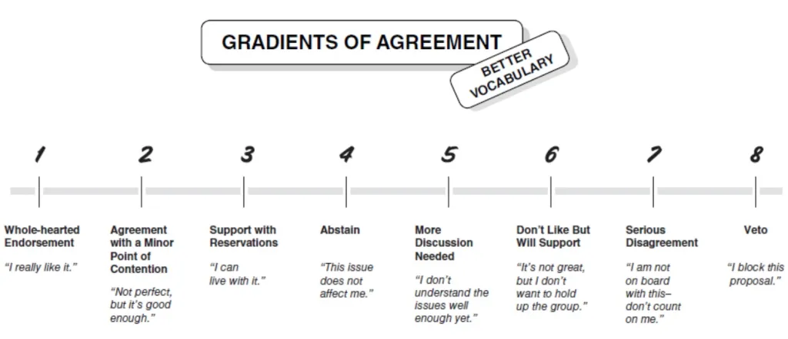

# TEAM ACTIVITY 2: Innovate as a Team

Welcome back! We hope today is a productive day getting to know your team and coding.

## Day 2 summary: 
Please complete the warm-up with your team, briefly review today’s objectives, and carefully read the Day 2 and Day 3 report out items to guide your efforts.  

## Objectives for Day 2
1. Work together to decide on the data sets you will use. Reminder: Use a decision-making technique discussed during Day 1. Kaner’s Gradient of Agreement is below for reference.
2. Practice joining your datasets together. 
3. Discuss and try creating interesting graphics.
4. Report back on your results at the end of the day. Today’s report back is short and focused on your team process. The Day 3 report back is more detailed. 

## Morning Warm-up
Please share the following informaton with your team. (No need to write down your responses this time)
- Name
- Pronouns
- Reflecting on Day 1, what is something that surprised you? (other things we thought about)

   *Reflections*
  - Define resilience more specifically
  - Not easy to observe what we want with remote sensing
  - Lots of work already on land use/disaster mitigation --> how do we make sure any of this research hasn't been already done? Also can we prioritize making our work publicly available and useful to those who would most benefit (applicable?)
  - A bit apprehensive about doing a summary/reinventing previous work. Exploratory phase is important but would be good to have concrete objective/outcome. Some things to think about: evaluating nature-based solutions. Potentially splitting off for a forestry based initiative sub group. Variables good but can we use an indicator?
  - Can we find a sizeable study area? One dataset and one indicator. Maybe something that has both wild area & urban with two timestamps (AM) and then in afternoon we could expand.
  - Get comfortable with systems/datasets
  - Can we get a paper out of this??? plot something by today
  - Stats: correlation on spatial data. Also general social survey - nationwide, large sample size, could request spatial information for data. For today: would be great to have a graph, but ideally just getting clear.
  - Innovation: what can we do that's new?
  - Workflow? what data are we using (feasibility)
  - Relationship between social and ecological resilience. How are different solutions driving ecological and social resilience?
  - Getting more comfortable with datasets

## Decision-Making
Use the gradient of agreement (Kaner 20214) to make decisions as a team.

## Day 2 Report Back
Day 2 report-back questions are about the team *process*. We are interested in your team’s unique experience. Below are some prompts you might consider. You don't need to address all of them - choose which ones you want to present. Please limit your reflection to 2-3 mins.  

1. **What worked well for your team?**
      - Using our different backgrounds to address each parts of our question. i.e. we had social scientists, statisticians (for analyses), ecologists, data scientists etc., breaking up action items/delegating
      - Voting with the gradient system, point system, etc.
      - whiteboard for visualization
3. **What’s one thing you would change?**
4. **Did your group ever have an “ah-ha” moment?  What led up to that moment?**
     - Not yet! Individual ah-ha's were more centered on learning (github, R, learning about new data!)
6. **Did your group experience the groan zone?  What is one tip you want to share with future groups at the Summit about getting through the groan zone?**
     - We went in and out. At first we struggled with narrowing down which datasets we wanted to use. We came to a consensus on variables which helped us move forward, but then we hit road blocks with the chosen datasets.

Goal for tomorrow: Visualize what we have and focus our direction for post-summit. Make an ArcGIS Online WebApp. 

**************************************************************

### Looking Ahead: Day 3 Report Back
*These are the prompts for the final Report Back **tomorrow (Day 3)** - start thinking about these questions as you work today. Each group will share their Day 3 GitHub page on the screen and give a 4 minute presentation.*

- **Project Title:** 
- **Research Question:** How does % change in land cover affect social and ecological resilience?
- **One interesting graphic/finding:** 
- **What are you thinking about doing next with your team? Long-term, short-term?**
    Short Term: Creating a case study of CA, assessing correlation of land use/land cover change with biodiversity, climate resilience, and social factors (income, etc.)
    Long Term: TBD
- **What’s missing: what resources, people, data sets, etc. does your team need?**
  
      
### Reminder
There is the opportunity for groups to continue working on their projects as an ESIIL Working Group. If you love your team and want to continue working together, considering submitting a Working Group Application this fall. See the ESIIL website for more information: <https://esiil.org/working-groups>.
     

